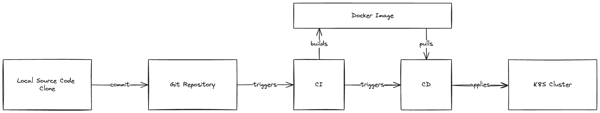
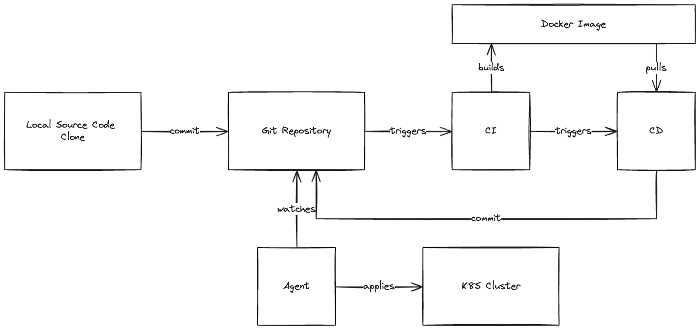

# GitOps

The usual development lifecycle occurs as follows: the developer writes the code, pushes it to the repository, and then the CI/CD pipeline takes over to build, test, and deploy the code to the target environment.



Although this approach works well, it has some drawbacks, such as the possibility of someone manually changing the code deployed in the target environment without reflecting those changes in the repository, leading to a divergence between the code in the repository and the code in the target environment.

To address this issue, GitOps was introduced. GitOps is a way to do Continuous Deployment. It works by using Git as a single source of truth for declarative infrastructure and applications definitions. With GitOps, the developer writes the code, pushes it to the repository, and then the CI/CD pipeline takes over to build and test the application. The difference is that an agent that watches the repository for changes is responsible for deploying the application to the target environment.



This also reduces coupling between the CI/CD process and the target environment. Since the CI/CD pipeline does not need to connect to the target environment to deploy the application.

## TODO

- Improve readme with running instructions
- Add more details about the project architecture and flow

## Running Locally

1. Create the Kubernetes cluster using kind

   ```bash
   kind create cluster --name=full-cycle-git-ops
   ```

1. Apply the Kubernetes configuration

   ```bash
   kubectl apply -k k8s/
   ```

1. Install Argo CD on the cluster

   ```bash
   kubectl create namespace argocd
   kubectl apply -n argocd -f https://raw.githubusercontent.com/argoproj/argo-cd/stable/manifests/install.yaml
   ```

1. Download and install the Argo CD CLI

   ```bash
   brew install argocd
   ```

1. Get the Argo CD password

   ```bash
   kubectl -n argocd get secret argocd-initial-admin-secret -o jsonpath="{.data.password}" | base64 -d
   ```

1. Run Argo CD

   ```bash
   kubectl port-forward svc/argocd-server -n argocd 8080:443
   ```

1. Access https://localhost:8080
1. Login with the `admin` user and the password you got previously
1. And follow the steps [in this video](https://github.com/emiliosheinz/full-cycle-git-ops/raw/main/docs/videos/create-app-on-argocd.mp4) to create a new app
   
     
